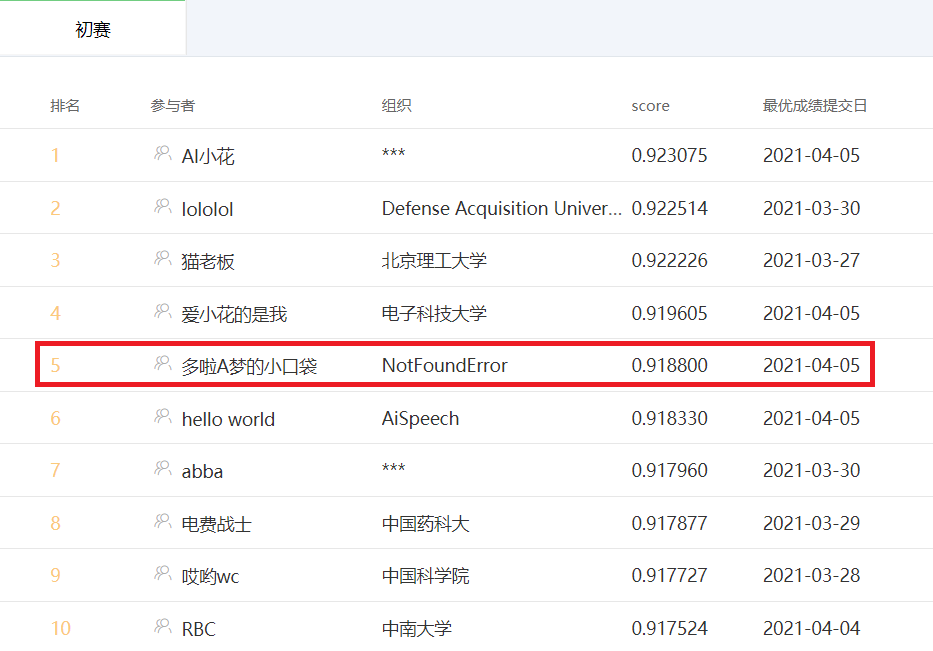

# 2021 GAIIC Task3 Preliminary Share

赛题 - 小布助手对话短文本语义匹配

十分荣幸能获得初赛最后一周的周星星，目前成绩第五，这里分享一些实验结果和心得给和我一样刚接触NLP比赛的同学们，同时也感谢比赛路上各位大佬开源的成果给我带来的帮助

## 模型架构

bert/nezha base 预训练+微调

## 数据增强

- 对偶 (`q1 - q2 = 1 => q2 - q1 = 1`)
- 闭包 (`q1 - q2 = 1 & q2 - q3 = 1 => q1 - q3 = 1`)

### 实验细节

- 闭包只造了正样本。如果正负样本都造效果会差2个千分点左右
- 数据增强只在预训练阶段，微调阶段使用原数据集
- 闭包造的正样本也对偶了

## 预训练

- 参考的是 `transformers` 官方的代码 [01_how_to_train.ipynb](https://github.com/huggingface/blog/blob/master/notebooks/01_how_to_train.ipynb)
- `vocab.txt` 是徒手解析原数据按空格切开生成的，没做词频对齐
- 加载了 `bert/nezha base` 的预训练权重，`embedding` 层重新初始化
- 预训练 `loss` 的值没有意义。并不是值越小，微调效果就越好 (同条件下 `loss 0.4` 的预训练模型比 `loss 0.3` 的模型线上效果差1个千分点)，建议按 `step` 数来选择 `epoch` 大小

## 模型

### 单模五折

model | auc
------|------
Nezha | 0.913
Bert  | 0.908

### 实验细节

- 模型拿到 `pool_output` 后接一层全连接层出结果，后接 `MLP` 和 `LSTM` 效果都没单层全连接好
- 不要过于相信离线指标 `auc/loss`，线下提升1个千分点，线上可能掉1个千分点 (血淋淋的教训)。同预训练一样，建议计算 `optimizer` 的优化步数
- 对抗训练 `PGD` 效果没 `FGM` 好，可能是调参问题 (`PGD` 实在是太慢了), `FGM` 能提升3个千分点左右
- [NeZha_Chinese_PyTorch](https://github.com/lonePatient/NeZha_Chinese_PyTorch) 大佬的代码前阵子更新过了，保存的模型变回 `300M` 左右了，没有 `1.2G` 那么大了，参考这套代码的朋友没注意的话可以看下

## 模型融合

目前线上成绩是 bert + nezha 后接 lightgbm (lgb永不为奴！)，同时加上了一些词频统计特征 (效果不是很明显，半个千分点左右)

## 模型推断

简单测试了一下，甩5万条数据进单模型的 `nezha` 要 `13` 分钟左右 (显卡2080Ti)，显然是不符合要求的，有幸能进复赛的话后续会在这块多下点功夫

## 后续工作

- 尝试下别的预训练模型或者mask策略
- 模型蒸馏
- 调参
- 模型推断性能优化

## 参考文献

- AI小花 - https://github.com/nilboy/reports/blob/master/gaic_track_3.md
- ch12hu - https://github.com/chizhu/tianchi-gaic-track3-share
- lololol - https://github.com/luoda888/2021-GAIIC-phase3-idea
- 猫老板 - https://gist.github.com/aloha12345x/b2b81c52dd5fee7b47e3a4eb537232f3
- 电费战士 - https://github.com/liucongg/2021-GAIIC-Task3-Share
- 哎哟wc - https://github.com/doubleQ2018/2021-GAIIC-Track3-share
